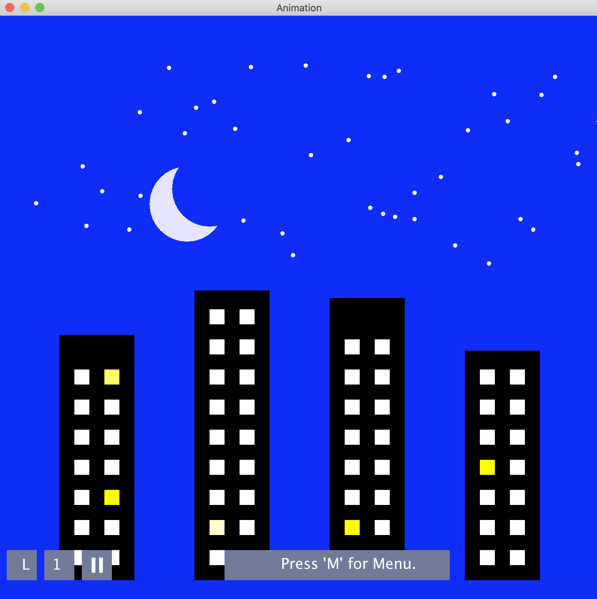

## Text-Based Animator
An application built in intelliJ using java which creates simple 2D animations of shapes from text description which describes animation in terms of what shapes should look like (color, size, and position) at key moments in the animation. The application has the ability to show the animation in multiple ways - visual (at still frames or in motion) and textual, depending on user specifications at the start and throughout the animation.
		
Given description of animation as input in the form:  
+ shape R rectangle 
    - to create a shape 
 + motion R t0 x0 y0 w0 l0 r0 g0 b0 t1 x1 y1 w1 l1 r1 g1 b1
    - to create a motion for the shape R such that from t0 to t1 R:
  		- moves from (x0, y0) to (x1, y1)
		- scales size from w0xl0 to w1xl1
		- changes RGB color from (r0, g0, b0) to (r1, g1, b1) 
	
the Animator builds model as well as the necessary controller and view to display animation in variety of ways:
+ As a movie/moving animation
+ As a movie/moving animation the user can interact with in the following ways (see below example of animation in process):
    - play/pause
    - diable/enable looping
    - increase/descrease the speed at which the animation is played

+ As a text file with a description of the animation
+ As an SVG file (XML-based format to describe images and animations)

This project increased my overall knowledge and understanding of the Model, View, Controller design pattern as a way to isolate the three behaviors of a complex graphical program.

To see this project code please click [here](https://github.com/hannah-weber/Animator).

# Principle Component Analysis Algorithm
Collection of simple functions to perform and visualize image compression and extraction using principle component analysis on a sample data set of face images. Programmed using Python in Jupyter Notebook application.

The notebook contains two main functions:
- pca_compress: compresses a given sample image from face image data set
- pca_extract: extracts estimate of sample image given compressed sample image
as well as functions used to visualize what the dimensionality reduction technique does and how it can vary in results depending on the amount of compression specified.

Overall, this project allowed me to apply mathematical concepts such us expected value, eigenvectors, and covariance to perform compression technique useful in many applications (i.e. in this case minimizing storage of faces for facial recognition software).

To see this project notebook click [here](https://github.com/hannah-weber/PrincipleComponentAnalysis).

## Linear Perceptron Algorithm
Collection of simple functions to perform and visualize training a linear perceptron on a sample data set. Programmed using Python in Jupyter Notebook application.

The notebook contains one main functions:
- update_perceptron: runs through one complete epoch to train linear perceptron model
as well as functions used to visualize training a linear percepton on given linearly seperable data set from an arbitrary starting perceptron, until no more errors.

This project gave me insight as to how simple concepts can be used to build a powerful Machine Learning tool. It gave me a greater understanding of what a reinforcement learning algorithm is and how it trains some model on given data.

To see this project notebook click [here](https://github.com/hannah-weber/LinearPerceptron).

## Pyramid Solitaire
Pyramid Solitaire game with textual display programmed in intelliJ using Java.

Game Play/Rules: 
Pyramid Solitaire is a card game which shuffles a standard deck of cards and deals them out into a 7-row triangle with each card partially covered by the two cards below it. The remaining cards are set aside as the stock pile, with 1-3 being laid face up to form the "draw" pile. The primary rule of the game is that you can remove any one or two exposed cards whose sum is 13 (Jacks are 11, Queens are 12, and Kings are 13), where an exposed card is any card not covered by cards beneath it or any card in the draw pile. Once a draw card is used it is replaced by a card from the stock pile. The game ends when either all cards have been removed, or there is no more moves to be made. The goal of the game is to minimize your final score which is calculated by summing the total of all remaining, non-discarded cards.

Game board is outputted using text to user. User can make moves using the following commands in the command line:
+ rm1 r c
	- To remove one card at row r, card c           
+ rm2 r1 c1 r2 c2
	- To remove one card at row r1, card c1 and one card at row r2, card c2 
+ rmwd  r1 c1 d
	- To remove one card at row r, card c and draw card d 
+ dd d
	- To discard draw card d 

To see this project code please click [here](https://github.com/hannah-weber/PyramidSolitaire).

